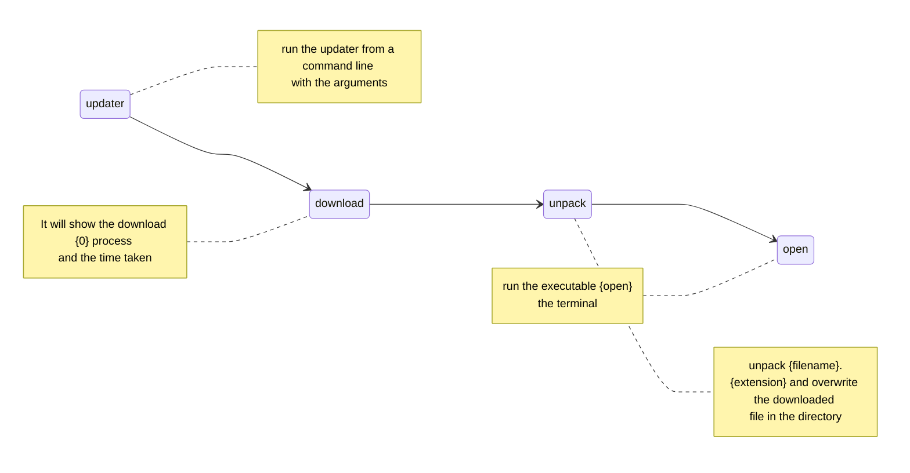

# 📦 Updater ~ [](https://github.com/danijerez/updater/releases) [](https://dotnet.microsoft.com/en-us/download/dotnet/8.0)

## Simple solution to update apps. Call `updater.exe` with commands arguments you need.

# 📚 Arg commands

| short  | long command | help  | remark  |
|---|---|---|---|
| 0 |   | Address where the compressed file (zip) to download is located. is required and must be  | `required`  |
| -f  | --filename  | Name with which the downloaded file will be saved, no need extension | `def`: update  |
| -e  | --extension  | Only use in special cases like 'msi', by default it autodetects, supported Archive Formats: Zip, GZip, Tar, Rar, 7Zip |  |
| -p  | --filepath  | Path where to download and unpack | `def`: base directory |
| -w |  --wait | Prevent the app from auto closing  |   |
| -o  | --open  | Executable to start when the process terminate  |   |
|  -r | --remove  | Remove files or directories before opening  | `separator ','`  |
| -i  | --ignore  | Ignore files when unzipping  |  `separator ','` |
| -d  | --decopass  | Password required to unzip the file  |   |
|   | --help  | Display this help screen  |   |
|   | --version  | Display version information  |   |




# ▶️ How to start 
💻 _in your favorite terminal_
```
.\updater 'url' -r update.zip -o 'exe' -w
```
🟢 _example zip_
```
.\updater https://github.com/NickeManarin/ScreenToGif/releases/download/2.37.1/ScreenToGif.2.37.1.Portable.x64.zip -o ScreenToGif.exe -w -r update, logs
```

 


🔮 _call example in c#_
```
    var exe = "MyExe.exe";
    var url = "https://..."

    ProcessStartInfo psInfo = new()
    {
        FileName = "updater.exe",
        UseShellExecute = true,
        Arguments = $"{url} -o {exe} -r update -w"
    };

    Process.Start(psInfo);
    Application.Exit();
                
```

🟢 _example msi_
```
https://www.exemsi.com/downloads/packages/Firefox/Firefox%20Setup%2014.0.1.msi -w -r update,logs -e msi
```

# 💾 Compiled
```
dotnet publish -p:PublishProfile=FolderProfile
```

# 🦄 Nugets
| Name        | Descripción | Version     |
| ----------- | ----------- | ----------- |
| [Serilog](https://github.com/saeidjoker/libc.translation/)   | Simple .NET logging with fully-structured events                                            |2.12.0|
| [SharpCompress ](https://github.com/adamhathcock/sharpcompress)   | .NET library compression types and formats.                                            |0.32.0|
| [ShellProgressBar](https://github.com/saeidjoker/libc.translation/)   | visualize (concurrent) progress in your console application    |5.2.0|
| [CommandLineParser](https://github.com/commandlineparser/commandline)   |  command line parser that brings standardized  |2.9.1|
