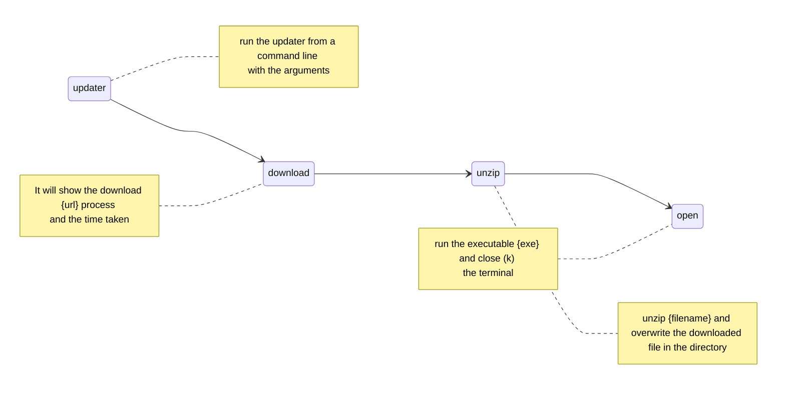

# 📦 Updater ~ [](https://github.com/danijerez/updater/releases) [](https://dotnet.microsoft.com/en-us/download/dotnet/7.0)

## Simple solution to update apps. Call `updater.exe` with whatever arguments you need.

# 📚 Arguments
1.  `{filename}`: name with which the downloaded file will be saved
2.  `{url}`: address where the compressed file (zip) to download is located
3.  `{exe}`: executable to start when the process terminate
4.  `k`: prevent the app from auto closing, is optional, if you run it from a terminal it is not necessary



# ▶️ How to start 
### _in your favorite terminal_
```
.\updater.exe 'filename' 'url' 'exe' k
```
### _example_
```
.\updater.exe samplevideo.zip https://www.sample-videos.com/zip/50mb.zip calc
```

 

# 🦄 Nugets
| Name        | Descripción | Version     |
| ----------- | ----------- | ----------- |
| [Serilog](https://github.com/saeidjoker/libc.translation/)   | Simple .NET logging with fully-structured events                                            |2.12.0|
| [DotNetZip](https://github.com/saeidjoker/libc.translation/)   | .NET library for handling ZIP files, and some associated tools.                                            |1.16.0|
| [ShellProgressBar](https://github.com/saeidjoker/libc.translation/)   | visualize (concurrent) progress in your console application    |5.2.0|
